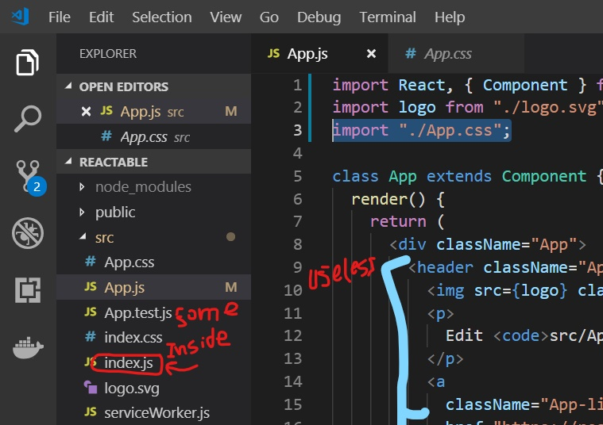

# minimal_react_app
Minimal React App with all un-necessary files deleted to speed up your developement

  Whenever we hit 
    <code>
    npx create-react-app project_name
    </code>
    
    It setups our local development environment.
    But the annoying part is that it <mark> brings some un-necessary files </mark>
    Like Following

    
    
    
    
    And brings some extra material in <code>App.js  </code> and <code>index.js</code> and the <code>public</code> folder.
    
    So i have decided to add some value to the community of React and to add to ease of you .
    So that you doo't have to clean the stuff again and again and should solely focus on the part,
    the part of the development that matters. 
    
The App Looks Like this when you run 
<code>npm start</code>
    

#### Cloning repository
Write Following Command in the terminal to clone the repository. 
    
<code>git clone https://github.com/umaresso/minimal_react_app <Write_Your_Project_Name> </code>

#### replce <Write_Your_Project_Name> with the project Name you desire
  
  You are All set :
  
  Now Start Developing !!!!
  Use It free and Share with mates.
  
  Follow to connect with me :D
  
  
>>>>>>> cd549123d9f8b6ab607ab4c7f7e1267529738851
